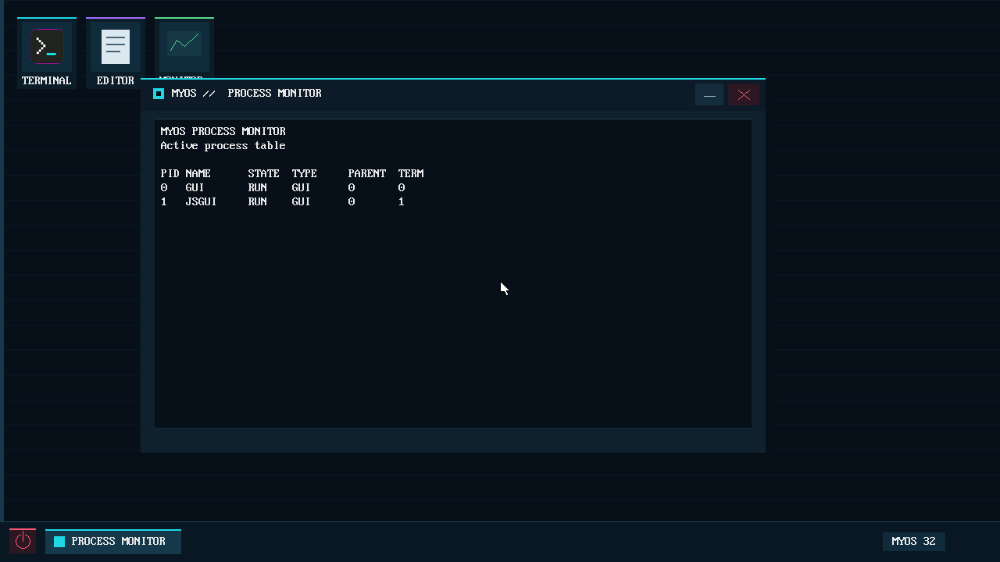
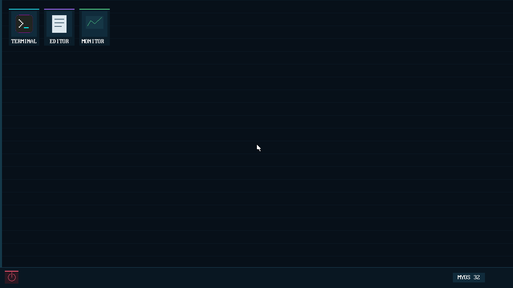
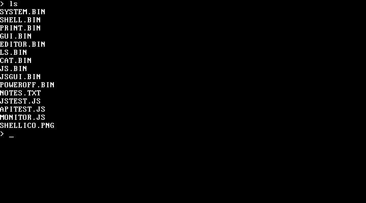

# MyOS: внутренняя документация

Этот каталог фиксирует текущее устройство проекта. Его нужно обновлять вместе с
изменениями ABI, карты памяти, формата диска и процесса сборки.

- [architecture.md](architecture.md) — загрузка, защищённый режим, память,
  процессы и файловая система.
- [syscalls.md](syscalls.md) — ABI `int 80h`/`IRETD` и таблица системных
  вызовов.
- [kernel-functions.md](kernel-functions.md) — внутренние подсистемы и функции
  ядра, их входы, результаты и правила изменения.
- [js-api.md](js-api.md) — полный справочник JS API, объектов, типов, лимитов и
  примеров.
- [development.md](development.md) — сборка, добавление программ, проверка и
  известные ограничения.
- [applications.md](applications.md) — индекс руководств по приложениям;
- [c-applications.md](c-applications.md) — программы на C и плоские `.BIN`;
- [js-applications.md](js-applications.md) — JS-runtime и `.JS`-приложения.
- [build-system.md](build-system.md) — устройство `build32.ps1`, `run32.ps1`
  и генератора PNG-иконки.
- [TODO.md](TODO.md) — приоритетный план стабилизации ядра, JS-runtime, GUI и
  файловой системы.

## Скриншоты

### Process Monitor

### GUI

### Shell

